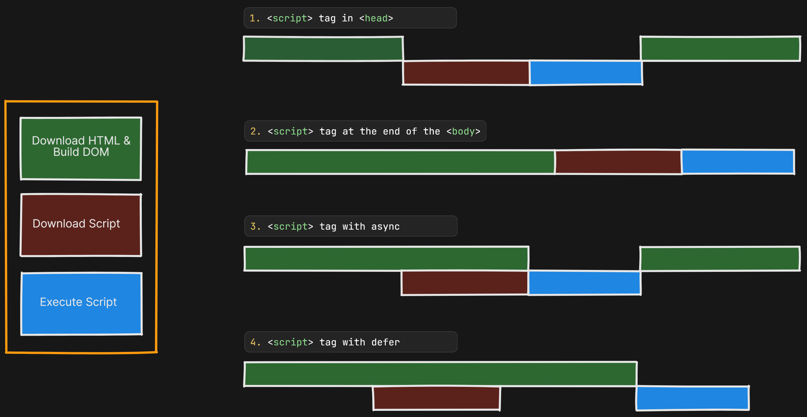

# 01 - Introduction to JavaScript

## 💡 Key Concepts Covered

1. **What is JavaScript?**

   - JavaScript is a scripting language that enables dynamic interactions on web pages.
   - It allows developers to build interactive, dynamic, and functional websites.
   - Works alongside HTML (structure) and CSS (style).

2. **The Crucial Process (Page Load Process):**

   - **Download HTML and Build DOM:** The browser first downloads the HTML content and parses it to create the Document Object Model (DOM). This represents the structure of the HTML document in memory.
   - **Download Script:** When the browser encounters a `<script>` tag, it will download the JavaScript file (if it's an external script).
   - **Execute Script:** nce the script is downloaded, the browser's JavaScript engine will execute the code within the `<script>` tag.

3. **Loading JavaScript Scripts:**
   - `<script>` tag inside `<head>`: Blocks HTML parsing until script is downloaded and executed.
   - `<script>` tag at the end of `<body>`: Allows HTML parsing first, then loads and runs the script.
   - `<script async>`: Downloads the script asynchronously while parsing HTML, but executes immediately once downloaded (may interrupt HTML parsing).
   - `<script defer>`: Downloads the script asynchronously during HTML parsing, but waits to execute until the HTML is fully parsed.

---

## 📈 Visual Understanding

Here’s a simple diagram to understand the flow:

_(Green = Download HTML & Build DOM, Brown = Download Script, Blue = Execute Script)_

---

## 🧠 Extra Notes

- **We can also use** `<script async src="...">` **inside `<head>`.**  
  This allows scripts to download while HTML is parsed, but the script will **execute as soon as it finishes downloading**, which could disrupt DOM construction.
- **Best Practice:**
  - Use `defer` for most scripts (application logic).
  - Use `async` for independent scripts (e.g., ads, analytics).

---

## 📜 Code Overview

- `index.html`:
  - Links to `first.js` using `defer` to optimize page load performance.
- `first.js`:
  - Logs "hello world!" to the console.
  - Dynamically updates a `
` element.

---

> **Tip:** Always choose your script loading strategy based on what your script needs: speed vs. proper execution order.

---
