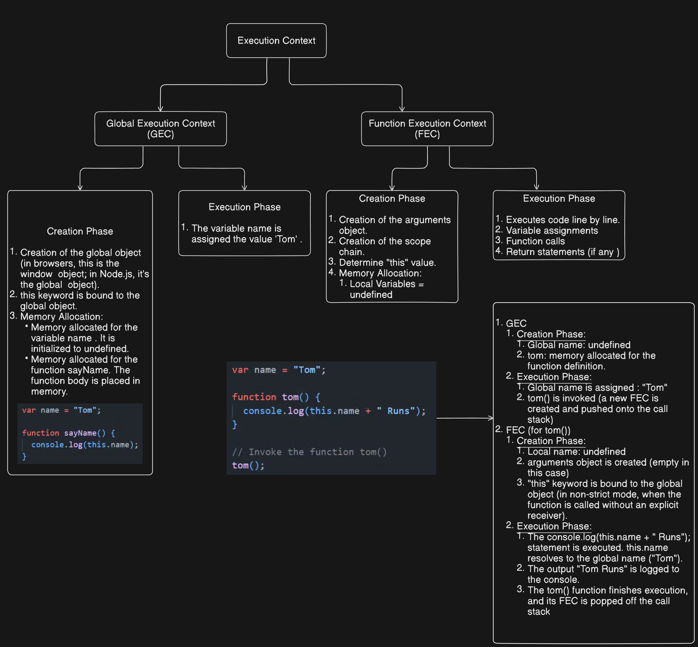
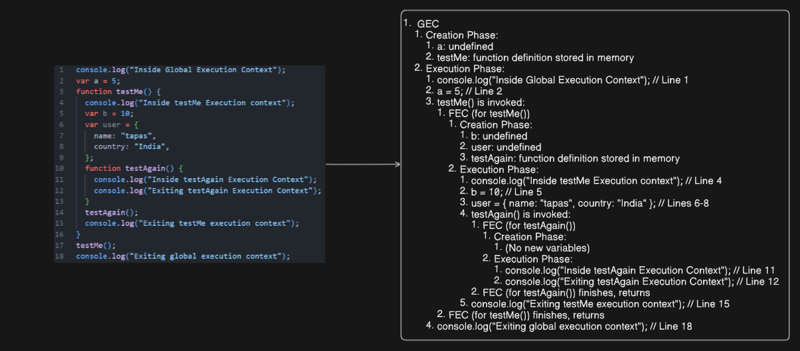

# JavaScript Execution Context 🧠

The **Execution Context** is a fundamental concept in JavaScript. Think of it as the environment in which your JavaScript code is currently running. It provides all the necessary information for the code to be executed, such as how variables are resolved, what `this` refers to, and the scope of variables and functions.

## Key Concepts

### 1. Execution Context

* **Definition:** The abstract environment where JavaScript code is executed. It's like a container that holds all the necessary information for the currently running code.
* **Types:** There are primarily two main types of execution contexts:
    * **Global Execution Context (GEC):** This is the default execution context that is created when the JavaScript engine first starts running your code. For code running in a browser, the global context is usually associated with the `window` object. In Node.js, it's the `global` object.
    * **Function Execution Context (FEC):** A new execution context is created every time a function is invoked (called). Each function call results in a new FEC being pushed onto the **call stack**.

### 2. Global Execution Context (GEC)

* **Creation:** Created when the JavaScript engine starts.
* **Global Object:** In browsers, it creates the `window` object (or `globalThis`). In Node.js, it creates the `global` object (or `globalThis`). These objects become the global scope.
* **`this` Binding:** In the GEC (in non-strict mode), the `this` keyword refers to the global object (`window` in browsers, `global` in Node.js).
* **Lifecycle:** The GEC is the first context to be pushed onto the call stack and is usually the last one to be popped off when the entire script has finished executing.
* **Variable and Function Declarations:** Variables declared outside any function (in the global scope) and top-level function declarations are stored in the GEC's environment.

### 3. Function Execution Context (FEC)

* **Creation:** Created and pushed onto the **call stack** whenever a function is called.
* **Components:** Each FEC has three important components:
    * **Variable Environment:** Stores variables, functions, and the `arguments` object of the current function.
    * **Lexical Environment:** A reference to its outer (parent) environment. This is what enables the **scope chain**.
    * **`this` Binding:** The value of the `this` keyword inside a function depends on how the function is called (e.g., method invocation, function invocation, constructor invocation, using `call()`, `apply()`, or `bind()`).

### 4. Lexical Environment

* **Definition:** The environment in which a variable or function is *lexically* (physically) defined in the source code. It's determined by where the function or variable is written.
* **Outer Environment Reference:** Each lexical environment has a reference to its outer (parent) lexical environment. For the global environment, the outer environment is `null`.
* **Scope Chain:** When JavaScript needs to resolve a variable, it first looks in the current execution context's lexical environment. If it doesn't find it there, it follows the reference to the outer lexical environment, and so on, up the chain until it finds the variable or reaches the global environment. This chain of lexical environments is known as the **scope chain**.

### 5. `this`

* **Definition:** A keyword that refers to the object that is currently executing the code. Its value is determined by how a function is called.
* **Common `this` Bindings:**
    * **Global Context:** In non-strict mode, `this` refers to the global object (`window` in browsers, `global` in Node.js). In strict mode (`'use strict'`), `this` is `undefined` in the global scope.
    * **Function Invocation (Standalone Function Call):** In non-strict mode, `this` refers to the global object. In strict mode, `this` is `undefined`.
    * **Method Invocation:** When a function is called as a method of an object, `this` refers to that object.
    * **Constructor Invocation (`new` keyword):** When a function is used as a constructor with the `new` keyword, a new object is created, and `this` inside the constructor function refers to this newly created object.
    * **`call()`, `apply()`, `bind()`:** These methods allow you to explicitly set the value of `this` when calling a function.

### 6. `window` (in Browsers)

* **Definition:** The global object in web browsers. It represents the browser window or tab in which the JavaScript code is running.
* **Global Scope:** Variables declared with `var` in the global scope become properties of the `window` object. Functions declared in the global scope become methods of the `window` object.
* **Top-Level Context:** The GEC in browsers is associated with the `window` object.

Understanding the execution context, scope chain, and the behavior of `this` is crucial for writing correct and predictable JavaScript code. They govern how variables are accessed and how functions operate within your programs.

## 🧩 JavaScript Execution Context - Diagram 01:

## 🧩 JavaScript Execution Context - Diagram 02:

